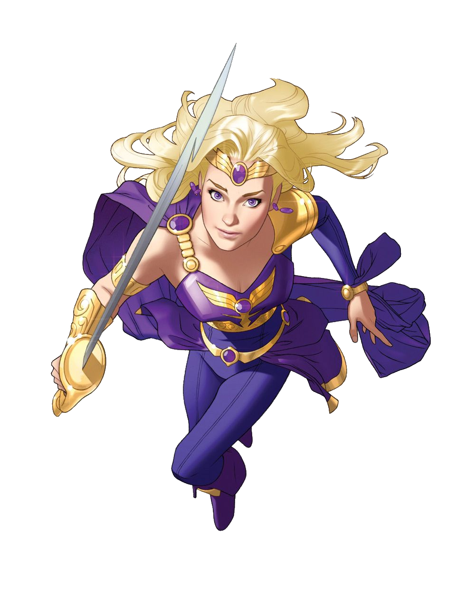
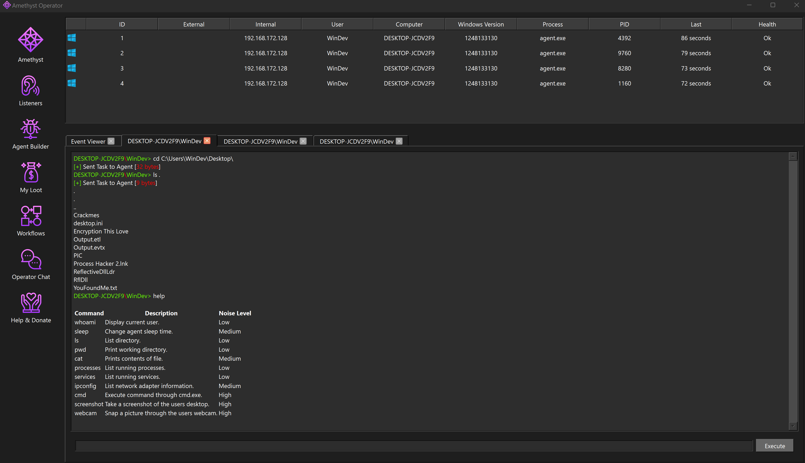
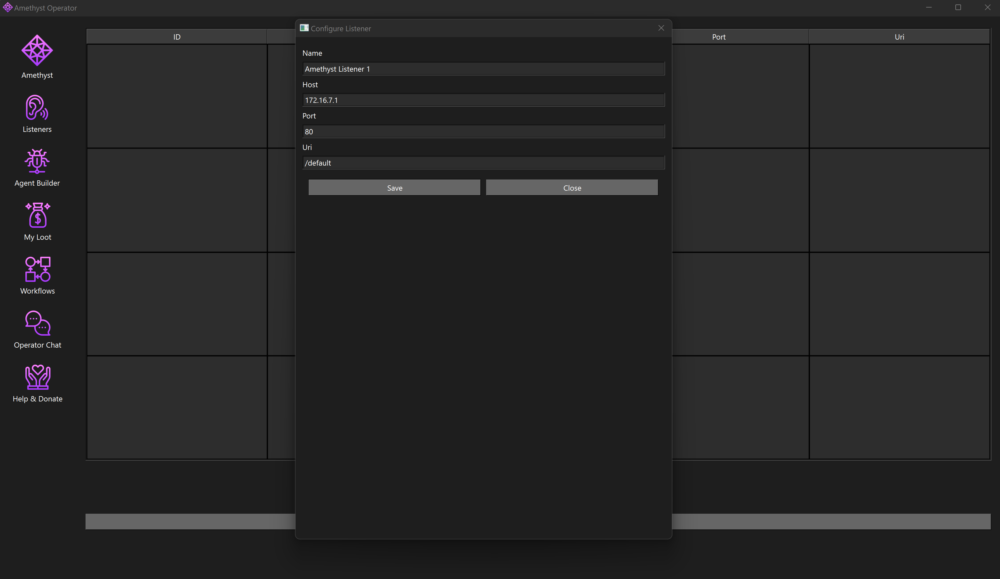

   

  <h1>Amethyst</h1>
   

  
<i>Amethyst is a Command & Control (c2) created by <a href="https://github.com/rottaj">@rottaj</a>.</i>

  
<i>This is a side project C2 and while it is operational, please note that development has been discontinued.</i>

> :warning: The use of this tool for malicious purposes is illegal and unethical. Always ensure that you have explicit permission to use this tool in any environment.

## About the project
Amethyst is a Command & Control (c2) written in Golang, C, and Qt C++. It was built
as a side project to learn more about C&C frameworks and their development techniques. 
Development on this project has been discontinued for several reasons. 
Primarily, I have shifted focus to other interests and new project ideas. 
Additionally, transitioning to an arm processor and dependencies on Qt for Arm, which require 
XCode and iCloud login on apple devices, presented obstacles to continued development. 

## Agent
The agent stub is written in C. It uses NTAPI (wrapped) functions to interact with the WinAPI. There is no indirect / direct syscall implementation. Data is transported via wininet, with GET requests containing the base64 encoded makeup (json) of the agent output within the URI. 
Upon initial connection with the team server, the agent is assigned a unique agent ID which is used for command & control.

## Teamserver
The team server is written in Golang and utilizes a Pub/Sub (Publisher/Subscriber) design pattern to handle incoming / outgoing messages between operators and infected agents. The team server utilizes two web technologies to handle this communication:
* Web sockets - Used for bi-directional communication between operators (clients) and the team server.
* HTTP - Used by infected agents. Communication occurs through the "Check in" function every n (seconds) when the agent checks in for its next task and transmits previous task output.

## Client
The client is written in Qt C++. There is no login or authentication setup. The client will automatically connect on localhost when executed. While Qt is fun to learn and smooth once you get moving, I don't foresee myself using it anytime in the near future. Unfortunately, I will likely return to web technologies for client applications.

## Demo
#### Agents

   

#### Listeners 

   

## Disclaimer
Use this software responsibly and only in environments where you have legal permission. 
The author of this tool is not responsible for any misuse or damages caused.
  
<b>Note:</b> The use of this tool for malicious purposes is illegal and unethical. Always ensure that you have explicit permission to use this tool in any environment.
